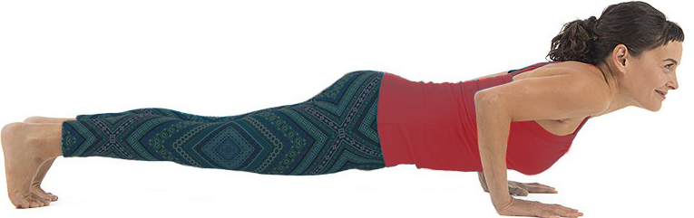
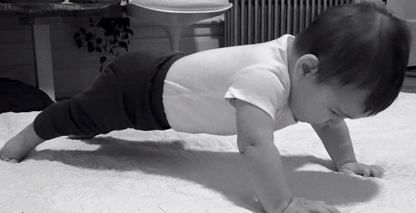

<h2> Test 2 </h2>

Model name: Simple CNN

Model architecture:

Model result:

Compared to the previous model, the architecture remains unchange. We changed the train-validation-test split ratio to increase the size of the validation and test sets in hope to verify that the previous was overfitted. From the graph, as we expected, the validation accuracy reduced by a whooping more than 10%. The model also got overfitted really early on. The divergence between the train and test set accuracy started to diverge in the 3rd epoch. There was also no improvement within the next 5 epochs, and it caused the training to stop early <strong>This is bad!</strong>

From the metrics, almost all the classes had their precision and recall values about 0.5. However, as from test_1, sample 8 got really low scores. Samples 7 and 9 got lower recall scores as well. We will need to investigate this issue.

From the confusion matrix, we can observe that as we increased the number of images in the test set, the error started to show up. Across almost all the classes, the missed labels seem to distribute randomly. That should be fine as we increase the complexity of the architecture as well as fine-tuned the hyper parameters. However, the issues were at classes 7, 8, and 9. It almost seems like that the model were confusing between the 3 of them. 

Here are some sample images from class 7, 8, and 9

Class 7

Class 8

Class 9

From these images, we can see that there are lots of similarities and overlapping between class 7 and 8. This might be the reason for the confusion between the two in the model. Class 9 has some similarities with class 7 and 8, which might cause issues as well, even though it is much less. 

Next steps:

- From the observation in the graph, we can see that the model started to be overfitted in the 3rd epoch. Hence, in the next model, we will apply a regularlizer scheduler that will half the learning rate every 3 epochs. The default learning rate for adam classifer is 0.001.
- We will also increase the early stopping patience to 10 to prevent the training from stopping too early.

